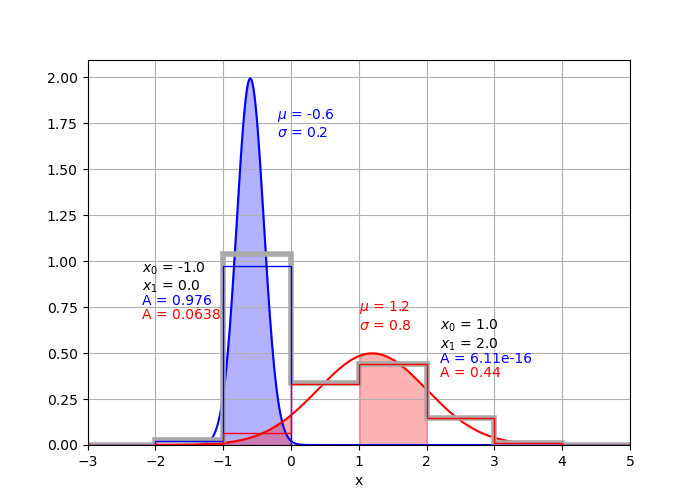

# Derivations

This documents contains the algebraic derivations of the error propigation formula used in this package in gory detail.  None of these are particularly challenging to derive, but they are annoying and I could not find most of them conveniently listed anywhere reputable online.  Please submit an issue if you find a mistake!

All derivations assume 
1. Input parameters are Gaussian random variables.
2. Input parameters are independent of each other (no covariance).

Under such assumptions, the following generic formula are used to propogate error.  For function 

$$ f(x_1, x_2, ... x_N) $$

where individual parameters $x_i$ each have error $\delta x_i$ the standard error in $f$ is given by

$$ \delta f = \sqrt{\sum_i^N \left(\frac{\partial f}{\partial x_i}\right)^2 \delta x_i^2} $$

## Standard

### Mean

$$ \mu = \frac{\sum_i^N x_i}{N} $$

$$ \frac{\partial \mu}{\partial x_i} = \frac{1}{N} $$

$$ \delta\mu = \sqrt{\sum_i^N \left(\frac{\partial \mu}{\partial x_i}\right)^2 \delta x_i^2} $$

$$ \delta\mu = \sqrt{\sum_i^N \left(\frac{1}{N}\right)^2 \delta x_i^2} = \frac{\sqrt{\sum_i^N \delta x_i^2}}{N} $$

### Standard Deviation

$$ \sigma = \sqrt{\frac{\sum_i^N(x_i-\mu)^2}{N-1}} = \frac{1}{\sqrt{N-1}}\left[\sum_i^N(x_i-\mu)^2\right]^{1/2} $$

$$ \frac{\partial \sigma}{\partial x_i} = \frac{1}{\sqrt{N-1}}\frac{1}{2}\left[\sum_i^N (x_i-\mu)^2\right]^{-1/2}\left[2(x_i-\mu)\right] = \frac{x_i-\mu}{\sqrt{(N-1)\sum_i^N(x_i-\mu)^2}} $$

$$ \frac{\partial \sigma}{\partial \mu} = \frac{1}{\sqrt{N-1}}\frac{1}{2}\left[\sum_i^N (x_i-\mu)^2\right]^{-1/2}\left[-2 \sum_i^N (x_i-\mu)\right] = -\frac{\sum_i^N(x_i-\mu)}{\sqrt{(N-1)\sum_i^N(x_i-\mu)^2}} $$

$$ \delta\sigma = \sqrt{\sum_i^N\left(\frac{\partial \sigma}{\partial x_i}\right)^2\delta x_i^2 + \left(\frac{\partial \sigma}{\partial \mu}\right)^2\delta \mu^2} $$

$$ \delta\sigma = \sqrt{\sum_i^N\left(\frac{x_i-\mu}{\sqrt{(N-1)\sum_i^N(x_i-\mu)^2}}\right)^2\delta x_i^2 + \left(-\frac{\sum_i^N(x_i-\mu)}{\sqrt{(N-1)\sum_i^N(x_i-\mu)^2}}\right)^2\delta\mu^2} $$

$$ \delta\sigma = \sqrt{\frac{\sum_i^N (x_i-\mu)^2\delta x_i^2 + \left[\sum_i^N(x_i-\mu)\right]^2\delta\mu^2}{(N-1)\sum_i^N(x_i-\mu)^2}} $$

### Histogram

To account for errors on individual points when generating a histogram, treat each point as a normalized Gaussaian with a mean of its value and a standard devation of its error.  Then calculate the are under the Gaussian between the edges of each histogram bin.  The sum of contributions from each individual point calculated in this way will be the total value of the histogram bin.

$$ g(x) = \frac{1}{\sigma\sqrt{2\pi}}e^{-\frac{(x-\mu)^2}{2\sigma^2}} $$

$$ A = \int_{x_0}^{x_1} g(x) dx = \int_{x_0}^{x_1} \frac{1}{\sigma\sqrt{2\pi}}e^{-\frac{(x-\mu)^2}{2\sigma^2}} $$

Use substitution to solve the integral.

$$ u = \frac{x-\mu}{\sqrt{2}\sigma} $$

$$ du = \frac{1}{\sqrt{2}\sigma} $$

$$ u_0 = \frac{x_0-\mu}{\sqrt{2}\sigma} $$

$$ u_1 = \frac{x_1-\mu}{\sqrt{2}\sigma} $$

$$ A = \frac{1}{\sqrt{\pi}} \int_{u_0}^{u_1} e^{-u^2} du $$

This integral can be solved with error functions.

$$ \textrm{erf}(z) = \frac{2}{\sqrt{\pi}} \int_0^z e^{-t^2} dt $$

$$ A = \frac{1}{2}\left[\frac{2}{\sqrt{\pi}} \int_0^{u_1} e^{-u^2} du - \frac{2}{\sqrt{\pi}} \int_0^{u_0} e^{-u^2} du\right] $$

$$ A = \frac{\textrm{erf}(u_1) - \textrm{erf}(u_0)}{2} $$

The digram shows the total histogram from two points in grey, plus the contributions from the blue and red points individually in their respective colors.  Note that the blue point has a relatively small error and narrow Gaussian width, so its contributions fall almost entirely in one bin and the blue contribution to that bin is close to one.  In contrast, the red point has a larger error and provides significant contributions to several bins.  The total area under each individual Gaussian is 1, so it is still possible to normalize the total histogram by dividing by the total number of points that contributed to it. 

## Weighted

### Mean
Each value has an independent weight $w_i$ so some values contribute more to the resulting mean than others.

$$ \mu = \frac{\sum_i^N w_i x_i}{\sum_i^N w_i} $$

$$ \frac{\partial \mu}{\partial x_i} = \frac{w_i}{\sum_i^N w_i} $$

$$ \delta\mu = \sqrt{\sum_i^N \left(\frac{\partial \mu}{\partial x_i}\right)^2 \delta x_i^2} $$

$$ \delta\mu = \sqrt{\sum_i^N \left(\frac{w_i}{\sum_i^N w_i}\right)^2 \delta x_i^2} = \frac{\sqrt{\sum_i^N w_i^2 \delta x_i^2}}{\sum_i^N w_i} $$

For weights equal to the inverse error squared ($w_i = \delta x_i^{-2}$)

$$ \delta\mu = \frac{\sqrt{\sum_i^N (\delta x_i^{-2})^2 \delta x_i^2}}{\sum_i^N (\delta x_i^{-2})} = \frac{\sqrt{\sum_i^N \delta x_i^{-2}}}{\sum_i^N \delta x_i^{-2}} = \frac{1}{\sqrt{\sum_i^N \delta x_i^{-2}}} $$

### Standard Deviation

M is the number of non-zero weights.

$$ \sigma = \sqrt{\frac{\sum_i^N w_i(x_i-\mu)^2}{\frac{M-1}{M}\sum_i^N w_i}} = \frac{1}{\sqrt{\frac{M-1}{M}\sum_i^N w_i}}\left[\sum_i^N w_i(x_i-\mu)^2\right]^{1/2} $$

$$ \frac{\partial \sigma}{\partial x_i} = \frac{1}{\sqrt{\frac{M-1}{M}\sum_i^N w_i}}\frac{1}{2}\left[\sum_i^N w_i(x_i-\mu)^2\right]^{-1/2}\left[2w_i(x_i-\mu)\right] = \frac{w_i(x_i-\mu)}{\sqrt{\left(\frac{M-1}{M}\sum_i^N w_i\right)\sum_i^N w_i(x_i-\mu)^2}} $$

$$ \frac{\partial \sigma}{\partial\mu} = \frac{1}{\sqrt{\frac{M-1}{M}\sum_i^N w_i}}\frac{1}{2}\left[\sum_i^N w_i(x_i-\mu)^2\right]^{-1/2}\left[-2\sum_i^N w_i(x_i-\mu)\right] = -\frac{\sum_i^N w_i(x_i-\mu)}{\sqrt{\left(\frac{M-1}{M}\sum_i^N w_i\right)\sum_i^N w_i(x_i-\mu)^2}} $$

$$ \delta\sigma = \sqrt{\sum_i^N\left(\frac{\partial \sigma}{\partial x_i}\right)^2\delta x_i^2 + \left(\frac{\partial \sigma}{\partial \mu}\right)^2\delta \mu^2} $$

$$ \delta\sigma = \sqrt{\sum_i^N\left(\frac{w_i(x_i-\mu)}{\sqrt{\left(\frac{M-1}{M}\sum_i^N w_i\right)\sum_i^N w_i(x_i-\mu)^2}}\right)^2\delta x_i^2 + \left(-\frac{\sum_i^N w_i(x_i-\mu)}{\sqrt{\left(\frac{M-1}{M}\sum_i^N w_i\right)\sum_i^N w_i(x_i-\mu)^2}}\right)^2\delta \mu^2} $$

$$ \delta\sigma = \sqrt{\frac{\sum_i^N w_i^2(x_i-\mu)^2\delta x_i^2 + \left[\sum_i^N w_i(x_i-\mu)\right]^2\delta\mu^2}{\left(\frac{M-1}{M}\sum_i^N w_i\right)\sum_i^N w_i(x_i-\mu)^2}}$$

